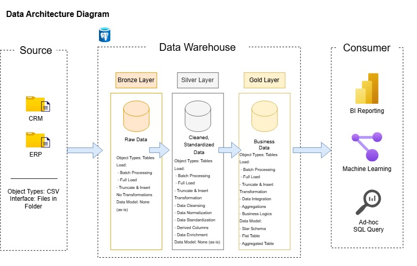
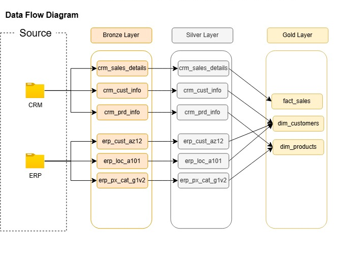
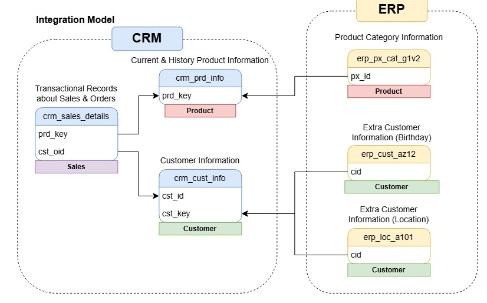
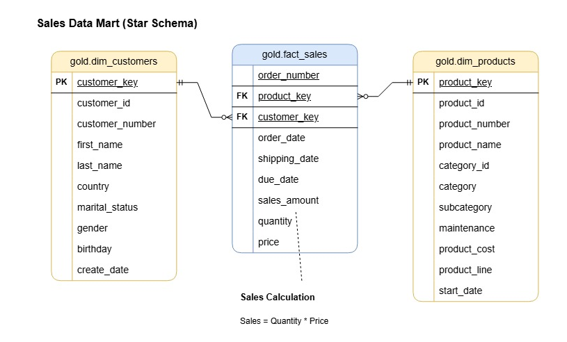

# SQL Data Warehouse & Analytics Project

A modern, end-to-end Data Warehouse solution implementing **Medallion Architecture (Bronze &rarr; Silver &rarr; Gold)** using SQL. This project ingests, cleanses, and integrates disparate CRM and ERP datasets into a business-ready dimensional model (Star Schema) for analytics and reporting.

---

## 🏗️ Architecture Overview

The data warehouse follows the multi-hop **Medallion Architecture**, progressing data from raw ingestion to business-ready analytical assets:



1. **Bronze Layer (Raw Ingestion):** Ingests raw data from CRM and ERP source CSV files directly into staging tables without schema alterations.
2. **Silver Layer (Cleansing & Transformation):** Deduplicates records, standardizes formats, handles missing values, and enforces relational integrity.
3. **Gold Layer (Analytical Star Schema):** Consolidates cleansed data into dimension and fact views optimized for BI reporting, ad-hoc queries, and downstream analytics.

---

## 🔄 Data Flow & Integration

The pipeline integrates multiple operational sources (CRM & ERP) across each medallion stage:



### Source Integration Model
- **CRM System:** Customer profile (`cust_info`), product master (`prd_info`), and transactional sales orders (`sales_details`).
- **ERP System:** Customer demographics (`cust_az12`), geographic locations (`loc_a101`), and product categories (`px_cat_g1v2`).



### Key Transformation Logic (Silver Layer)
- **Customer Cleansing:** Deduplication via `ROW_NUMBER()`, trimming whitespace, standardizing gender (`'M'`, `'F'` &rarr; `'Male'`, `'Female'`) and marital status (`'M'`, `'S'` &rarr; `'Married'`, `'Single'`).
- **Product Normalization:** Parsing category keys, standardizing product line codes, and deriving active date spans using `LEAD()`.
- **Sales Normalization:** Converting `YYYYMMDD` integer dates to `DATE`, recalculating zero/negative sales amounts (`sales = quantity * price`), and repairing unit prices.
- **ERP Data Cleaning:** Removing ID prefixes (`'NAS'`), filtering future birth dates, and standardizing country codes (`'DE'` &rarr; `'Germany'`, `'US'`/`'USA'` &rarr; `'United States'`).

---

## 🌟 Gold Layer Data Model (Star Schema)

The analytical Gold Layer is modeled as a Kimball-style Star Schema for optimized query performance:



- **`gold.dim_customers`**: Enriched customer dimension combining CRM demographics with ERP geographical and birth date details.
- **`gold.dim_products`**: Product dimension mapping category hierarchies, costs, and filtering active catalog items.
- **`gold.fact_sales`**: Transactional sales facts linked to dimensions via surrogate keys.

*For complete field descriptions, data types, and definitions, see the [Data Catalog](docs/data_catalog.md).*

---

## 📁 Repository Structure

```plaintext
├── datasets/                   # Raw source data files
│   ├── source_crm/             # CRM datasets (cust_info, prd_info, sales_details)
│   └── source_erp/             # ERP datasets (CUST_AZ12, LOC_A101, PX_CAT_G1V2)
├── docs/                       # Architecture diagrams and data catalog
│   ├── data_architecture_diagram.png
│   ├── data_flow_diagram.png
│   ├── integration_model.png
│   ├── sales_data_mart_star_schema.png
│   └── data_catalog.md         # Detailed Gold Layer dictionary
├── scripts/                    # SQL DDL and ETL stored procedures
│   ├── init_db.sql             # Database & schema initialization
│   ├── bronze/                 # Bronze DDL & batch load procedure
│   ├── silver/                 # Silver DDL & transformation procedure
│   └── gold/                   # Gold Star Schema view definitions
└── tests/                      # Automated data validation test suites
    ├── quality_checks_silver.sql
    └── quality_checks_gold.sql
```

---

## 🧪 Data Quality & Validation

Automated test suites in `tests/` ensure warehouse integrity:
- **Primary & Surrogate Key Uniqueness:** Verifies no duplicates exist in dimension keys.
- **Referential Integrity:** Validates that all foreign keys in `fact_sales` resolve to existing records in dimensions.
- **Business Logic Checks:** Confirms valid order chronology (`order_date <= shipping_date`), valid financial metrics (`sales_amount = quantity * price`), and reasonable birth date ranges.

---

## 🚀 Getting Started

### Prerequisites
- PostgreSQL / SQL Server database instance.
- SQL client (e.g., pgAdmin, DBeaver, Azure Data Studio, SSMS).

### Execution Order
1. **Initialize Database & Schemas:**
   ```sql
   \i scripts/init_db.sql
   ```
2. **Setup & Load Bronze Layer:**
   ```sql
   \i scripts/bronze/ddl_bronze.sql
   \i scripts/bronze/proc_load_bronze.sql
   CALL bronze.load_bronze();
   ```
3. **Setup & Load Silver Layer:**
   ```sql
   \i scripts/silver/ddl_silver.sql
   \i scripts/silver/proc_load_silver.sql
   CALL silver.load_silver();
   ```
4. **Build Gold Layer Views:**
   ```sql
   \i scripts/gold/ddl_gold.sql
   ```
5. **Run Data Quality Tests:**
   ```sql
   \i tests/quality_checks_silver.sql
   \i tests/quality_checks_gold.sql
   ```

---

## 📄 License
This project is licensed under the [MIT License](LICENSE).

---

## 🤝 Acknowledgments
*This `README.md` and documentation were prepared with the assistance of **Google Antigravity (AGY)**.*
